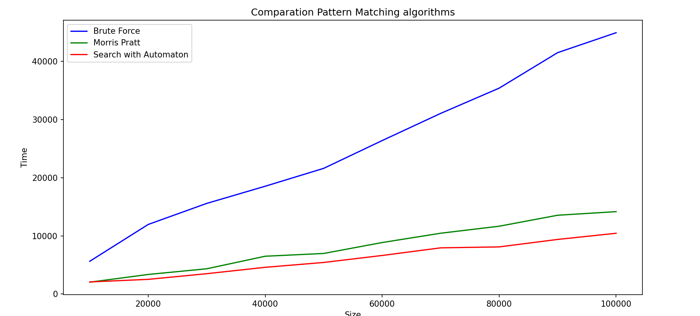
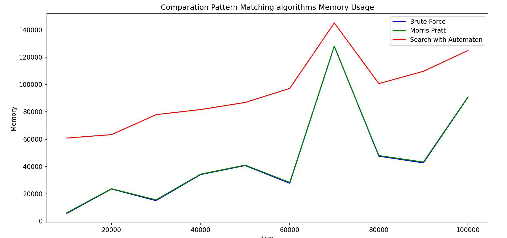
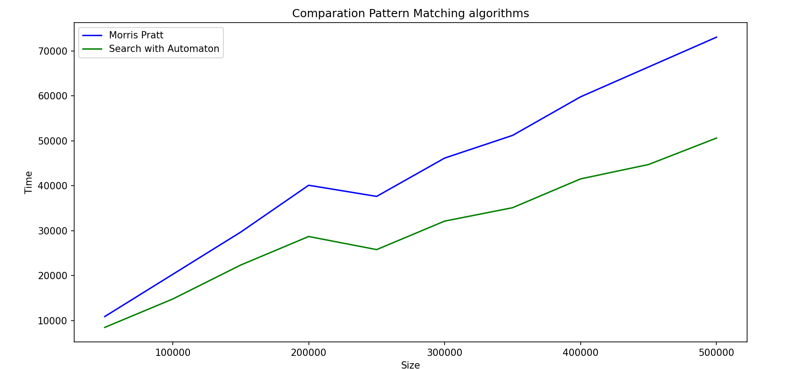
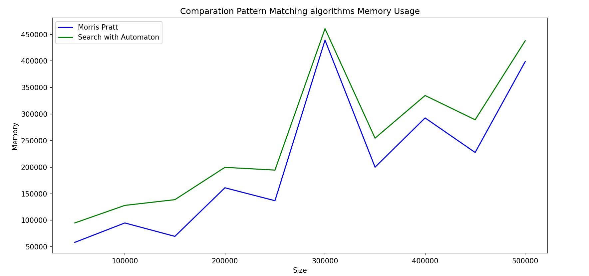

# About this repo

Simple python project to show a way to take experiental execution time to compare a set of algorithms (three in this case) in fair way.

## Pattern Matching


### Problem statement
​
The problem is to find a pattern in a text

| Algorithm            | Best Case        | Average Case     | Worst Case       | Space Complexity |
|----------------------|-----------------|------------------|------------------|------------------|
| **Brute Force**      | \( O(mn) \)       | \( O(mn) \)      | \( O(mn) \)      | \( O(1) \)        |
| **Morris-Pratt**     | \( O(n + m) \)       | \( O(n + m) \)   | \( O(n + m) \)   | \( O(m) \)        |
| **Automaton Search** | \( O(n) \)       | \( O(n) \)       | \( O(n) \)       | \( O(mσ) \)  |


# Visualization

## Comparison Brute Force, Morris Pratt and Search with automaton

| Size   | Brute Force (Time, Memory) | Morris Pratt (Time, Memory) | Search with Automaton (Time, Memory) |
|--------|----------------------------------|------------------------------------|--------------------------------------------|
| 10000  | (5638, 5712)                     | (2043, 6204)                       | (2086, 60844)                              |
| 20000  | (11972, 23568)                   | (3371, 23764)                      | (2529, 63340)                              |
| 30000  | (15590, 15024)                   | (4349, 15596)                      | (3505, 77964)                              |
| 40000  | (18545, 34096)                   | (6506, 34396)                      | (4600, 81708)                              |
| 50000  | (21619, 40720)                   | (6983, 41044)                      | (5435, 86892)                              |
| 60000  | (26397, 27728)                   | (8860, 28364)                      | (6636, 97196)                              |
| 70000  | (31071, 128016)                  | (10462, 128116)                    | (7949, 145100)                             |
| 80000  | (35412, 47568)                   | (11667, 48036)                     | (8110, 100684)                             |
| 90000  | (41518, 42672)                   | (13554, 43276)                     | (9395, 109700)                             |
| 100000 | (44946, 90672)                   | (14174, 90948)                     | (10456, 124932)                            |






## Compariosn Morris Pratt and Search with automaton

| Size   |  Morris Pratt (Time, Memory) | Search with Automaton (Time, Memory) |
|--------|----------------------------------|------------------------------------|
| 50000  | (10899, 58300)                   | (8486, 94924)                      | -                                          |
| 100000 | (20288, 94908)                   | (14801, 127980)                     | -                                          |
| 150000 | (29687, 69636)                   | (22360, 138764)                     | -                                          |
| 200000 | (40109, 161172)                  | (28708, 199660)                     | -                                          |
| 250000 | (37629, 136796)                  | (25794, 194476)                     | -                                          |
| 300000 | (46153, 439268)                  | (32130, 460876)                     | -                                          |
| 350000 | (51202, 200028)                  | (35118, 254668)                     | -                                          |
| 400000 | (59783, 292732)                  | (41525, 335020)                     | -                                          |
| 450000 | (66422, 227684)                  | (44721, 289292)                     | -                                          |
| 500000 | (73054, 398908)                  | (50611, 438156)                     | -                                          |







# Python version
Python 3.11.0
​
# Running locally and testing

* Note: This instructions are for mac. Windows or linux may require some changes. 
* A good idea for this project, is to use a virtual environment, you could set up one with: [virtualenv](https://virtualenv.pypa.io/en/latest/).
* To create the virtual environment: `virtualenv env`
* To activate it:`source env/bin/activate`
* To install dependencies: `pip3 install -r requirements.txt`
* To run unit testing: `./test.sh`
* To try a default example, run: `: ./run.sh`. In the file ./run.sh is just an example, you can modify it. Theck the `app.py` file to get to understand how it works.

# Current coverage

Make sure you have "coverage" in your requirements.txt file and run pip install. Then run `coverage run -m unittest discover` and after that run `coverage report` to get the following table:

```
Name                                 Stmts   Miss  Cover
--------------------------------------------------------
pattern_matching\__init__.py             0      0   100%
pattern_matching\algorithms.py          72      0   100%
pattern_matching\constants.py            2      0   100%
pattern_matching\data_generator.py      21      4    81%
test\__init__.py                         0      0   100%
test\test_algorithms.py                 24      1    96%
test\test_data_generator.py             21      1    95%
--------------------------------------------------------
TOTAL                                  140      6    96%
```

# Code beautifier
This code has been beautify using black: https://github.com/psf/black. 
The command to use is `black . -l 120`.
